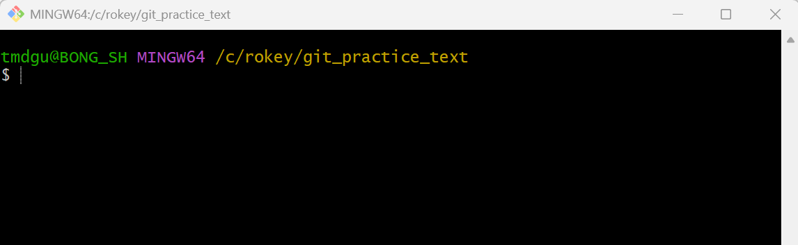

# Git & GitHub

<aside>
🔗

https://www.youtube.com/watch?v=wi_MU9zp86o

</aside>

## Ch1. Git과 GitHub 개념 이해

### 1.1 Git vs GitHub

- Git: 코드 변경 이력을 관리해주는 도구. “**버전 관리** 시스템”
    - 누가 언제, 무엇을, 왜, 어떻게 수정했는지 변경 이력을 확인 가능.
    - 소스 코드를 특정 시점으로 되돌리기 가능(이슈트래커, Issue Tracker 지원).
    - GitHub을 이용하여 자신의 Git을 쉽게 공유 가능.
    - **협업 체계**: 같은 파일을 가지고 여러 명과 함께 작업 가능.
        - 각각의 파트를 나누고 쉽게 합치기
        - 서로 변경 사항과 충돌하는 일 없이 작업
    - Visual Studio, Jetbrains IntelliJ, Android Studio 등 대부분의 IDE에서 git 연동 제공.
- Git의 역할
    - 소스 병합 (merge, rebase)
    - 소스 리비전 관리 (reset, commit, branch)
    - 소스 릴리즈 (push)
    - 소스 태깅 (tag)
    - 소스 변경사항 검토 (diff, log)
- GitHub: 코드 저장소, 코드를 저장하고 공유할 수 있는 웹 상의 도구
    - 온라인 상 저장 공간을 만들어 원격으로 관리
    - 그래픽 인터페이스 제공

## Ch2. Git 인터페이스 설정

### 2.1 커맨드 라인 인터페이스(Command-Line Interface, CLI)

- 깃을 사용하는 방법 중 하나.
- 별도 프로그램 설치 없이 깃만 설치하면 바로 사용 가능한 기본적인 방법.
- 모든 기능을 지원하고, 가장 많이 사용하는 방법.

### 2.2 설치 방법

- Git 다운로드: [https://git-scm.com/install/windows](https://git-scm.com/install/windows)
- 설치 시 참고: [https://m.blog.naver.com/10hsb04/223460283150](https://m.blog.naver.com/10hsb04/223460283150)
- 실습 준비
    1. Git으로 관리할 프로젝트 생성: 새 폴더 만들기
    2. 폴더 선택 후, “Git Bash Here” 클릭
        - Git Bash: 사용자가 명령어를 입력 및 실행할 수 있도록 명령행 인터페이스 제공해주는 프로그램(윈도우에 설치하면 자동으로 함께 설치되는 소프트웨어 도구의 일종)
    3. Git Bash 창(폴더 명 확인): 명령어 입력하는 창.
        
        
        

### 2.3 기본 설정 명령어

- 명령어 종류
    - 깃 명령어: 저장소 내에서 버전 관리, 협업 등 깃이 제공하는 다양한 기능 수행을 위해 입력하는 명령어. git으로 시작.
    - 시스템 명령어: 폴더 이동, 파일 생성 및 삭제 등 컴퓨터 시스템 관련 기능 수행을 위해 입력하는 명령어. 리눅스 운영체제의 시스템 명령어에 기반.
- 기본 명령어
    - `git`: git이 설치되었다면 git과 관련된 여러 정보 출력.
    - `clear`: 새로운 명령어 시작할 수 있게 Git Bash 창 내용 청소.
- 설정
    - `git config` 명령어를 통해 계정에 대한 정보 설정
    
    ```bash
    git config --global user.name “유저명”
    git config --global user.email “메일 주소”
    ```
    
    - 설정 정보 확인
    
    ```bash
    git config user.name
    git config user.email
    ```
    
    - `ls` : 현재 폴더 안의 내용 리스트로 확인.
    - `ls -al`  : 현재 폴더 안의 모든 내용(숨겨진 폴더 포함)을 자세히 리스트로 확인.
    - `git init` : 해당 폴더를 깃 프로젝트로 만들고 깃을 관리하기 시작하겠다.
        
        
        
        - .git 폴더는 숨김 폴더. 해당 폴더 내에서 git 관련 내용을 관리하는 폴더.

## Ch3. Git 저장소 관리

### 3.1 Git의 세 가지 관리 영역

- Git 프로젝트는 내부에 가상의 관리 영역을 만들어 파일의 상태를 구분하고 버전을 관리.
- 관리 영역
    - Working Directory(작업 트리, 작업 디렉터리)
        - 개발자가 실제로 작업을 하는 영역.
        - git init을 하기 전부터 원래 있던 폴더.
    - Staging Area(Staging 영역, 스테이징)
        - 개발자가 Working Directory에서 작업을 하다가 문서의 수정 사항을 기록으로 남겨 놓고자 할 때, 수정 이력을 기록할 파일을 잠시 대기 시키는 장소.
    - Repository(저장소)
        - 스테이징 영역에서 대기 중이던 파일들의 수정 이력이 최종적으로 기록되는 장소.
        - 해당 프로젝트의 수정 이력이 저장.

## 3.2 Git의 버전 관리

- Git은 Git 프로젝트의 작업 디렉터리 내 다른 문서들의 수정 사항을 추적(tracking)한다.
- 문서 상황에 따른 문서의 상태
    - untracked file: 이제 막 생성된 파일, 추적이 되고 있지 않은 상태.
    - unmodified file: 추적 중인 파일이나, 딱히 수정 사항이 없는 상태.
    - modified file: 추적 중인 파일이며, 수정 사항이 감지된 상태.
- Git 사용자는 워킹 디렉터리에서 감지된 신규/수정 문서를 스테이징 영역으로 이동 시켜야 한다. 스테이징 영역으로 이동한 문서는 커밋(Commit) 작업을 거쳐 최종적으로 저장소에 기록된다.
- Git을 이용한 프로젝트 버전 관리
    - 문서 작업 이력을 쌓아나가기 위해 git 명령어로 내가 만든 파일의 상태와 영역을 변경하는 작업
    - git 저장소 내부에 쌓여 있는 이력을 기반으로 사용자는 문서 내용을 과거 특정 시점으로 변경, 이력 간 변경 사항 모니터링 하는 등 다양한 작업 진행이 가능.

## 3.3 git 프로젝트 관리를 위한 명령어

- `touch 파일명.파일형식` : 문서를 생성하는 시스템 명령어
- `$ git status`
    - git 프로젝트 상태를 확인하는 깃 명령어
    
    
    
- `$ git add 파일명` : 워킹 디렉터리 내 문서를 스테이징 영역에 추가하는 깃 명령어
    
    
    
    - 스테이징 영역으로 이동한 상태.
    - `$ git add .` : 현재 워킹 디렉터리에 있는 모든 수정 사항을 한번에 옮긴다.
- `$ git commit`
    - 스테이징 영역 내에 대기 중인 문서를 리포지토리에 추가하는 깃 명령어
    
    
    
    - `git commit` 입력 시, 터미널 에디터(VI, VIM)로 변한다.
    - 커밋 메시지(기록을 남길 때, 남기고 싶은 메시지)를 써준 다음 넘어가는 절차
        - `shift+I` : 아래가 INSERT로 바뀌면, 내가 남기고 싶은 메시지 작성.
        - `esc` : INSERT 표시 없애기.
        - `shift + :` , `wq`  입력한 뒤, `Enter` → w로 저장하고, q로 끝내기.
    
    
    
    - 첫 번째 수정 이력 기록.
    - `$ git commit -m "커밋 메시지"` : 터미널 에디터를 열지 않고 지금 바로 커밋 메시지를 작성.
- `$ git log`
    - 커밋한 수정 이력을 확인하는 깃 명령어
    
    
    
    - 해당 폴더에서 어떤 기록들이 있었는지 이력을 확인 가능.
    - 구성 요소
        - 커밋 해시
        - 작업자 정보
        - 날짜와 시간
        - 커밋 메시지
        - 특정 커밋에 대해서는 브랜치명과 HEAD 참조자가 표시

## Ch4. gitignore

### 4.1 .gitignore

- git 프로젝트 내 문서 중 수정 이력에서 제외하고 싶은 문서가 있다면 이를 git이 추적하지 않도록 설정할 수 있다.
- `$ touch .gitignore` :  gitignore 파일(숨김 파일)이 생성.
- `.gitignore`
    - 해당 파일에 git에 의해서 감지되지 않았으면 하는 내용에 대한 목록을 작성.
    - .gitignore를 보는 법: 보기>표시>숨김 항목 체크
        - 메모장으로 실행 후 추적을 피하고 싶은 파일이나 폴더 명 작성.
        - 메모장으로 실행 후 추적을 피하고 싶은 파일이나 폴더 명 작성.
        - 메모장으로 실행 후 추적을 피하고 싶은 파일이나 폴더 명 작성.
    - 명령어: `nano .gitignore`
        - nano 인터페이스 실행 됨.
        
        
        
        - 숨기고 싶은 파일(폴더)명 입력
            - 패턴 규칙
                - 기본 매칭 규칙
                    - 경로 전체를 대상으로 매칭
                - 와일드카드 (`*`, `?`, `[]`)
                    - `*` : 0개 이상의 문자열
                    - `?` : 정확히 1글자
                    - `[]` : 문자 집합
                - 디렉토리 구분 (`/`)
                    - 슬래시 없음(`temp`): 파일, 폴더 모두 무시
                    - 슬래시 있음(`temp/`): 폴더(디렉토리)만 무시
                    - `/git_temp` : 프로젝트 루트에 있는 `temp` 만 무시
                    - `src/temp/` : `scr` 안의`temp` 만 무시
                - 재귀 매칭 (`**`)
                    - `**/temp` : 모든 위치의 `temp`
                    - `logs/**/*.log` : `logs` 폴더 아래 모든 `.log`
                - 예외 처리 (`!`)
                    - `!important.log` : `important.log` 만 다시 포함
        - `ctrl+x` , `Y` , gitignore에 `Enter` 입력
        → 입력한 파일에 대한 감지 안됨.
        
        
        
- `.gitignore` 가 잘 적용됐는지 검증하는 방법
    1. `git status` : 무시 대상이면 목록에 나오지 않음.
    2. `git status --ignored`: ignore 파일까지 포함해서 보기
        
        
        
    3. `git check-ignore -v 파일명`
        - 특정 파일이 왜 ignore되는지 추적
        - 어떤 `.gitignore` 파일의 몇 번째 줄 규칙이 적용됐는지까지 보여주는 가장 정확한 검증 방법
            
            
            
- 이미 추적된 파일을 .gitignore 적용시키는 방법
    - 이미 `tracked` 상태인 파일은 `.gitignore`로 제외되지 않는다.
    - `git rm --cached 파일명` : 추적 해제 명령어
    - 이미 Git이 추적 중인 파일은 `.gitignore`에 추가해도 적용되지 않으며, `git rm --cached`로 추적을 해제해야 한다.

## Ch5. 커밋 이력

### 5.1 커밋 이력에 표시되는 정보

- 작업자 정보(Author)
- 날짜 및 시간(Date)
- 커밋 메시지: 이때 당시 무엇을 했는지 확인 가능 → 최대한 자세히 적는 것을 추천.
    - 커밋 메시지 규칙
        
        
        | feat | 새로운 기능 추가 |
        | --- | --- |
        | fix | 버그 수정 |
        | docs | 문서 수정 |
        | style | 코드 스타일 수정 (기능 변경 없음) |
        | refactor | 코드 구조 개선 |
        | test | 테스트 코드 추가 |
        | chore | 기타 작업 (빌드 설정 등) |
- 커밋 해시: 커밋 기록에 대한 고유 식별자.
- HEAD: 현재 작업 중인 커밋을 가리키는 포인터. 일반적으로 브랜치를 통해 해당 커밋을 참조한다.
- 브랜치명: 기존 저장소에서 분기된 저장소의 복사본인 ‘브랜치’의 이름.


### 5.2 git log 옵션 & 커밋 이동 명령어

- `$ git log -p` : 커밋의 변경사항까지 함께 출력하는 옵션
    - `q` 눌러서 나갈 수 있다.
- `$ git log -숫자` : 숫자 만큼의 최신 커밋만 확인하는 옵션(`-p -숫자` 로 응용 가능)
- `$ git log --oneline` : 각 커밋을 요약해 한 줄씩 출력하는 옵션
- `$ git log --oneline --graph --all` : 브랜치 구조 시각화 옵션.
- `$ git log --oneline --decorate` : HEAD, 브랜치 위치 표시
- `$ git checkout 커밋해시` : 특정 커밋 시점으로 작업 디렉토리를 이동하는 명령어
    - 커밋 해시는 7자리만 적어도 되돌릴 수 있다.
    - 특정 커밋 시점으로 이동(브랜치에서 분리된 상태).
    - 코드 확인, 테스트, 임시 수정 가능. 단, 여기서 커밋하면 브랜치에 연결되지 않음.
        - 돌아가기: `$ git checkout 돌아갈_시점의_커밋해시`
            - `master` 브랜치의 경우, 커밋해시 대신 `master`를 적어도 된다.
            - 돌아갈 시점의 커밋 해시를 확인하는 방법
                - `$ git reflog` : HEAD 포인터의 참조 이력을 출력하는 깃 명령어
                    - 최신 커밋이 기억 나지 않는 경우 사용.
                    - HEAD 이동 기록.
                    - `git reflog`이력을 통해 돌아가고 싶은 커밋 확인 가능.
        - 여기서 작업 이어서 하기
            - `$ git switch -c 새_브랜치` : 새 브랜치 생성 후 작업

## Ch6. 실수에 대응하는 법

### 6.1 커밋할 생각이 없는데 스테이징 한 경우

1. 스테이징 실수 되돌리기 → **스테이징 취소**
    - `git reset 파일명` / `git restore --staged 파일명`
    - 실수로 워킹 디렉토리 내 문서를 스테이징 영역에 추가한 경우.
        - `git reset` 명령어를 입력해 스테이징 영역에 올라가 있던 파일을 초기화.
        - 스테이징 영역에 올라간 파일을 **스테이징 영역에서 제거**.
        - 워킹 디렉토리의 작업 내용은 유지.
2. 커밋 실수를 되돌리기 → **reset**
    - `git reset 커밋해시 --옵션` (돌아가고자 하는 시점의 커밋해시)
        - `git reset` 은 브랜치(HEAD)를 이동시키는 명령.
    - 실수로 커밋 이력이 추가가 된 경우.
        - `git reset` 명령어와 돌아가고자 하는 시점의 `커밋 해시`를 입력해 커밋 이력 되돌리기.
    - 사용 가능한 옵션: 어느 영역까지만 되돌릴지 선택 가능
        - 옵션 작성하지 않은 경우, `--mixed` 가 자동으로 선택
        
        |  | 워킹 디렉터리 | 스테이징 영역 | 리포지토리 |
        | --- | --- | --- | --- |
        | `--soft` | 현 상태 유지 | 현 상태 유지 | 커밋 이동 |
        | `--mixed` | 현 상태 유지 | 스테이징 초기화 | 커밋 이동 |
        | `--hard` | 현재 변경사항 삭제 후 커밋 상태로 맞춤 | 스테이징 초기화 | 커밋 이동 |
3. 커밋 실수를 되돌리고 이를 기록하기 → **revert**
    - `git revert 커밋해시` (실수 한 시점의 커밋해시)
        - 불필요한 수정 상황을 없애고 싶은데, 이조차도 기록으로 남기고 싶은 경우
        - 사용해야 하는 상황
            - 이미 push된 커밋을 되돌릴 때 사용
            - 협업 환경에서 안전한 방법(히스토리를 지우면 안되는 경우)
    - `git revert` 특정 커밋의 변경 상황을 되돌리고, ‘커밋 수정 사항을 되돌렸다’는 사실을 이력으로 남기는 명령.
    - `git revert`  사용 시, 커밋 해시가 늘어난다. (새로운 커밋 생성)
4. 커밋 메시지만 수정
    - `git commit --amend`

## Ch7. 브랜치 관리하기

### 7.1 브랜치: 기존 저장소에서 분기된 저장소의 **복사본**

- **브랜치**
    - 브랜치는 특정 커밋을 가리키는 포인터(참조).
    - 브랜치를 추가 시, 같은 커밋을 가리키는 포인터가 하나 추가된다.
    - 브랜치에 커밋이 추가되면서 분기가 발생한다.
- 브랜치 사용 목적
    - 개발 시 리스크를 줄일 수 있는 방법.
        - 기능별로 작업을 분리하고, 안정적인 코드와 실험적 코드를 분리하기 위함.
            - 개발을 하다 보면 코드를 여러 개로 복사해야 하는 일이 자주 생긴다.
            - 코드를 통째로 복사하고 나서 원래 코드와는 상관없이 독립적으로 개발을 진행할 수 있도록 한다.
- `master` / `main` 브랜치
    - 초기 브랜치(기본 브랜치)
        - Git 저장소를 생성하면 기본 브랜치(’master’ 또는 ‘main’)가 생성된다.
        - 초기 커밋을 가리키는 포인터이다.
    - 개발은 이 기본 브랜치에서 시작되며, 필요에 따라 새로운 브랜치를 만들어 작업을 **분리**할 수 있다. (분기 생성)
        - 새로운 브랜치는 기존 커밋을 기반으로 생성되며, 이후 독립적으로 커밋을 쌓아 나간다.
        - 실험적이거나 위험한 코드가 포함된 작업은 별도의 브랜치에서 수행하여 안정적인 코드와 분리할 수 있다.
    - 작업이 완료되면 `git merge`를 통해 다른 브랜치의 변경사항을 현재 브랜치에 **통합**할 수 있다.
- 브랜치 그래프 확인: `git log --oneline --graph --all`
    - 결과 해석 방법
        
        
        
        - 전체 구조
            
            ```bash
                    0387627 (test1)
                   /
            c0666bb ── c3cbf4d(master) ── f4d068c (test2)
            ```
            
        - 한 줄씩 해석
            - `* 0387627 (HEAD -> test1)`
                - `*` → 커밋 하나
                - `HEAD -> test1` : 현재 작업 브랜치
            - `| * f4d068c (test2)`
                - `|` → 다른 브랜치 흐름 유지 중
                - `*` → test2의 커밋
            - `|/`
                - 두 브랜치가 여기서 같은 조상으로 합쳐짐
            - `* c3cbf4d (master)`
                - master 브랜치의 위치
            - `* c0666bb`
                - 최초 커밋

### 7.2 깃 브랜치 관리하기 명령어

- `$ git branch` : 현재 브랜치 목록을 볼 수 있는 깃 명령어
    - `*` : 현재 당신이 있는 브랜치를 표시.


- `$ git branch 브랜치이름` : 새로운 브랜치를 생성
- `$ git checkout 브랜치이름` : 작업 중인 브랜치를 변경
- `$ git checkout -` : 바로 직전에 있던 브랜치로 이동
- `$ git switch 브랜치이름` : 작업 중인 브랜치를 변경
- `$ git switch -c 브랜치이름` : 새로운 브랜치를 생성하고 이동
- `$ git merge 브랜치이름` : 다른 브랜치의 변경사항을 현재 브랜치에 통합
- `$ git branch -d 브랜치이름` : 병합된 브랜치를 삭제

## Ch8. 깃허브 원격 저장소

### 8.1 깃허브

- 깃허브: 깃 저장소 호스팅을 지원하는 웹 서비스.
    - 온라인 상에 저장소를 만들어 원격으로 이를 관리할 수 있다.
    - 명령행 인터페이스를 제공하는 깃과 달리, 깃허브는 그래픽 인터페이스를 제공하기 때문에 사용자 입장에서 보다 편리하게 깃 저장소를 관리할 수 있다.
    
    
    
    - 로컬 저장소에서 작업→원격 저장소 생성→원격 저장소에 로컬 저장소의 내용을 업로드

### 8.2 원격 저장소 이용 관련 명령어

- `$ git remote -v` : 현재 깃 프로젝트에 등록된 연격 저장소 확인하는 깃 명령어
- `$ git remote add 원격저장소이름 원격저장소주소` : 현재 깃 프로젝트에 원격 저장소를 등록하고, 여기에 이름(별칭)을 붙이는 깃 명령어
- `$ git push` : 로컬 저장소의 내용을 원격 저장소에 공유할 때 사용하는 깃 명령어
- `$ git pull` : 원격 저장소의 내용을 로컬 저장소로 가져와 자동 병합하는 깃 명령어

### 8.3 깃허브 사용 방법

1. 깃허브 회원 가입: [https://github.com/](https://github.com/)
2. 로컬 저장소 폴더를 생성하고, 해당 폴더를 깃 프로젝트로 만든다.
3. 깃허브에서 원격 저장소를 만든다. 깃 프로젝트 폴더를 하나 만든다.
    1. Repositories>New repository: 새로운 저장소를 만든다.
    2. 원하는 저장소 이름 지정
        
        
        
    3. Public: 누구라도 저장소에 주소만 입력하면 접근 가능.
    Private: 주소를 알아도 허락된 사람만 접근 가능. (관리에 대한 추가 요구 사항 존재)
        
        
        
    4. Description: 설명
    5. Add a README file
    : 자동으로 README 이름의 파일을 추가되고, Description 내용이 들어간다.
    6. 저장소의 주소 확인: 로컬 저장소와 원격 저장소의 연결 고리 역할.
        
        
        
4. 로컬 저장소의 내용을 원격 저장소로 올리기
    1. `$ git remote add 원격저장소이름 원격저장소주소` : 로컬 저장소와 원격 저장소를 연결
        - 일반적으로 원격 저장소 이름은 ‘origin’으로 한다.
        - 원격 저장소가 여러 명이 프로젝트 진행 시 공유되는 원본의 역할을 수행하기 때문
            
            
            
        - fetch(내려받기): 원격 저장소의 내용을 내려받을 때 해당 주소를 사용.
        - push: 원격 저장소에 로컬 저장소 내용을 올릴 때 해당 주소를 사용.
    2. `$ git push` 를 통해 원격 저장소에 로컬 저장소의 내용을 올린다.
        1. 처음 `$ git push` 시, 아래와 같은 창이 출력 됨.
            
            
            
        2. 내가 정확히 어떤 저장소의 어떤 브랜치에 push를 할 것인지에 대한 명시가 필요.
        (로컬 저장소와 원격 저장소에는 각각의 브랜치가 따로 운용될 수 있고, 로컬 저장소의 브랜치와 원격 저장소의 브랜치의 이름이 항상 같다고 단정지을 수 없기 때문.)
        3. `--set-upstream`  : 정확히 어느 저장소의 어느 브랜치와 연결할 것인지 명시.
        4. `$ git push -u 원격저장소이름 브랜치명` 
            
            
            
    3. 원격 저장소와 연결된다.
        
        
        
        - 파일 내용, 커밋 메시지, 커밋 이력 등 확인 가능
5. 원격 저장소를 먼저 만들고, 로컬 저장소로 내려받기
    1. 깃허브에 원격 저장소 생성
    2. 저장소의 주소 확인
        
        
        
    3. 로컬 깃 프로젝트가 들어있는 상위 폴더로 이동
        1. `cd ..` : 상위 폴더로 나간다. 리눅스 명령어
        2. `cd 들어가고싶은폴더명`  : 폴더 간 이동을 할 때 사용하는 명령어
    4. `$ git clone 원격저장소주소`  : 원격 저장소를 복사본을 가져온다.
        
        
        
        - 깃 허브에서 기본 브랜치 이름을 main으로 설정한다.
    5. 온라인 상에서 파일 생성
        1. Add file>Create new file
        2. 제목, 내용 입력 후 ‘Commit changes…’ 클릭
            
            
            
        3. 원격 저장소에서 그래픽적인 커밋 처리가 진행되고 커밋 메시지 자동 완성 됨.
        4. `$ git pull` : 원격 저장소의 내용이 로컬 저장소로 가져올 수 있다.

### 8.4 깃허브로 그룹 프로젝트 진행하기

1. 레포지토리 생성 후, 팀원 초대
    
    
    
2. **프로젝트 환경 세팅**
    1. **develop 브랜치** 생성 *# 8.2, 8.3 내용 참조*
        - master 브랜치: 유저가 실제로 사용하는 내용이 올라가는 공간
        → **최대한 완벽한 코드만** 올라간다.
        - develop 브랜치: 개발자가 자유롭게 개발하는 브랜치
            - 로컬 레포지토리에 develop 브랜치 생성
            - `git push 원격저장소명 develop` 로 원격 저장소에 develop 브랜치 올리기
    2. **master 브랜치 보호**하기
        - 개개인이 바꿀 수 없도록 보호하기
        - Settings>Branches>Add classic branch protection rule
        - 보호 설정
            - **Require a pull request before merging**
                - 직접 push 금지/리뷰 승인 필수
                - 혼자 마음대로 main을 바꾸지 못하게 막는 안전장치
                - 세부 옵션
                    - Require approvals
                    해당 기능이 활성화되면, 일치하는 브랜치를 대상으로 Pull Request는 병합 전에 일정 수의 승인 필요. 변경 요청은 없어야
                    - Required number of approvals before merging
                    코드를 합치기 위해 필요한 '승인' 최소 인원수를 정한다.
                    (1이면 팀장 혼자 설정)
                    - Dismiss state pull request approvals when new commits are pushed
                    새로운 코드가 추가(Commit)되면 기존에 받아두었던 승인을 무효화.
                    다시 승인 받게 하는 안전장치.
                    - Require review form Code Owners
                    특정 파일이나 폴더의 담당자(Code Owner)가 반드시 승인해야 merge 가능.
                    - Require approval of the most recent reviewable push
                    가장 최근 푸시된 코드에 대해서 반드시 새로운 승인 필요.
                    이미 승인을 받은 PR이라도, 팀원이 마지막에 코드를 단 한 줄이라도 수정해서 다시 Push하면 이전에 받았던 '승인' 상태를 즉시 무효화시키는 기능.
                    - master 브랜치에 올리는 방법
                        
                        ```bash
                        # 1. 브랜치 생성
                        git switch -c feature
                        
                        # 2. 작업 후 push
                        git push origin feature
                        
                        # 3. GitHub에서 PR 생성
                        # 4. 승인 받기
                        # 5. merge
                        ```
                        
            - **Lock branch**
                - 해당 브랜치는 읽기 전용(read-only**)** 상태
                - push, merge 모두 불가/보존, 보호 목적
                - 작업 방법
                    - 브랜치 잠금 해제 → 관리자만 가능
                    - 새 브랜치 사용 → 작업 후 PR (잠금 해제 전까지 merge 불가)
            - Require status checks to pass before merging
                - 코드를 합치기 전에 자동화된 테스트나 빌드가 성공했는지 확인.
                (CI/CD를 연동했을 때 사용 하는 옵션)
            - Require conversation resolution before merging
                - 팀장이 팀원의 코드에 '이 부분 수정하세요.'라고 리뷰 댓글을 달았을 때, 해당 댓글에 대해 'Resolved' 버튼을 눌러 논의가 종료되지 않으면 Merge를 막는다.
            - Require signed commits
                - 디지털 서명이 확인된 커밋만 허용.
                - 해당 커밋을 실제로 그 사람이 작성했는지 보안상 신원을 보증할 때 사용
            - Require linear history
                - Merge할 때 Merge Commit 방식이 아닌 Rebase나 Squash merge를 강제하여 커밋 히스토리를 한 줄로 깔끔하게 관리.
            - Require deployments to succeed before merging
                - 특정 환경에 배포가 성공적으로 완료되어야만 main에 코드를 합칠 수 있게 제한.
            - Do not allow bypassing the above settings
                - 위에서 설정한 모든 규칙을 팀장에게도 똑같이 적용.
            - Allow force pushes
                - `git push --force` 명령어를 허용.
                - 기존 히스토리를 덮어써 버리는 위험한 작업.
                - **절대 체크하지 않는 것**을 권장
            - Allow deletions
                - 해당 브랜치(main)를 삭제할 수 있게 허용
                - **체크하지 않는 것**이 기본
    3. **프로젝트 보드** 만들기
        - projects>Create New project
        - add item → 해야 할 항목 작성하기
            
            
            
            - 해당 issue로 부터 브랜치 생성 가능
            → 각각의 개발 리스트가 어떤 브랜치와 연결되어 있는지 관리 가능
                
                
                
3. 개인 환경 세팅
    1. `git clone <원격저장소주소> <설정할 폴더이름>`  : 원격 저장소를 복사본을 가져온다.
    2. 프로젝트 내용 확인→해당 **issue로 부터 브랜치 생성**
    3. 로컬 레포지토리에 해당 브랜치 생성
        
        ```python
        # 방법 A
        
        # 1. 로컬 작업실을 development 브랜치로 변경
        git checkout development
        
        # 2. 깃허브(origin)의 최신 development 코드를 가져와서 내 파일에 바로 합치기
        # Fetch + Merge
        # 다른 팀원과 같은 파일을 수정했다면 충돌 발생 가능
        git pull origin development
        
        # 3. 최신 코드가 반영된 상태에서 나만의 새로운 작업 브랜치 생성 및 이동
        git checkout -b feature/ai-#1
        ```
        
        ```bash
        # 방법 B
        
        # 1. 로컬 작업실을 development 브랜치로 변경
        git checkout development
        
        # 2. 다른 팀원이 합쳐놓은 코드가 있을지 모르니 최신본 받아오기
        
        # 2-1. 원격 저장소의 최신 상태를 내 컴퓨터에 동기화
        # 정보(리스트와 이력만 다운)만 업데이트(실제 소스코드 파일들은 변화X)
        git fetch origin
        
        # 2-2. 방금 fetch로 긁어온 원격의 최신 development 내용
        # (origin/development)을 내 로컬 파일에 합치기
        git merge origin/development
        
        # 3. 작업할 브랜치 생성하기
        # 새로운 작업을 수행할 브랜치 생성: <feature/기능명-#이슈번호 혹은 설명>
        git checkout -b feature/ai-#1
        ```
        
    - 주의 사항
        - 작업하는 브랜치 확인하기!!
            - development 하위에 있는 ‘feature/기능명-#번호’에서 수행할 것!
        - master 브랜치에서 작업 절대 X
4. 개발 시작
5. 소스코드 올리기
    1. `git add .` → `git commit -m “커밋메시지”` → `git push` 
    2. 해당 작업 브랜치에 소스코드가 올라간다.
    3. 내가 만든 코드를 develop에 옮기기
        1. **풀 리퀘스트(PR)** 만들기: 작업한 브랜치 → develop
            - 내 코드를 다른 브랜치로 보내기 위한 허가를 받는 작업.
            
            
            
        2. 내가 한 부분 간략히 설명 적고, create pull request
6. 코드 리뷰 받기
    1. Pull Requests>File Changed: 변경 사항을 확인해 리뷰 남기기
        
        
        
        
        
    2. 다른 팀원이 짠 코드 확인하고 리뷰 남긴다.
        - Approve: PR 승인
        - Request changes: 변경 필요. 프로젝트 진행을 막는다.
7. 코드 수정하기: 리뷰 내용에 부합하게 코드 수정
    - 다른 팀원에 의해 Approve 받는다.
        
        
        
8. 승인 받은 후, 코드 Merge하기
    1. Merge pull request>Confirm merge
    2. develop 브랜치에 수정된 내용이 올라간다.
9. **충돌(Conflicts) 발생 해결 방법**
    1. 충돌 원인
        - 여러 명이 작업을 하다 보면, 브랜치의 버전이 달라진다.
            
            
            
    2. 해결 방법: web editor/**command line**
        
        
        
        1. develop 브랜치에 최신 코드 가져오기
            - `git checkout develop` →`git pull origin develop`
        2. 다시 내 브랜치로 돌아가기
            - `git checkout -`
        3. develop 브랜치와 Merge해주기
            1. 로컬 레포지토리에서 develop과 내 브랜치를 Merge하기
                - `git merge develop`
                    
                    
                    
                - 충돌되는 부분 팀원들과 의논해 고치
        4. 완성된 코드 다시 올리기
10. 프로젝트에서 상태 표시
11. 배포하기: develop → master로 올리기
    - PR 만들기: develop → master
        
        
        
    - 코드 확인하고 리뷰, Approve